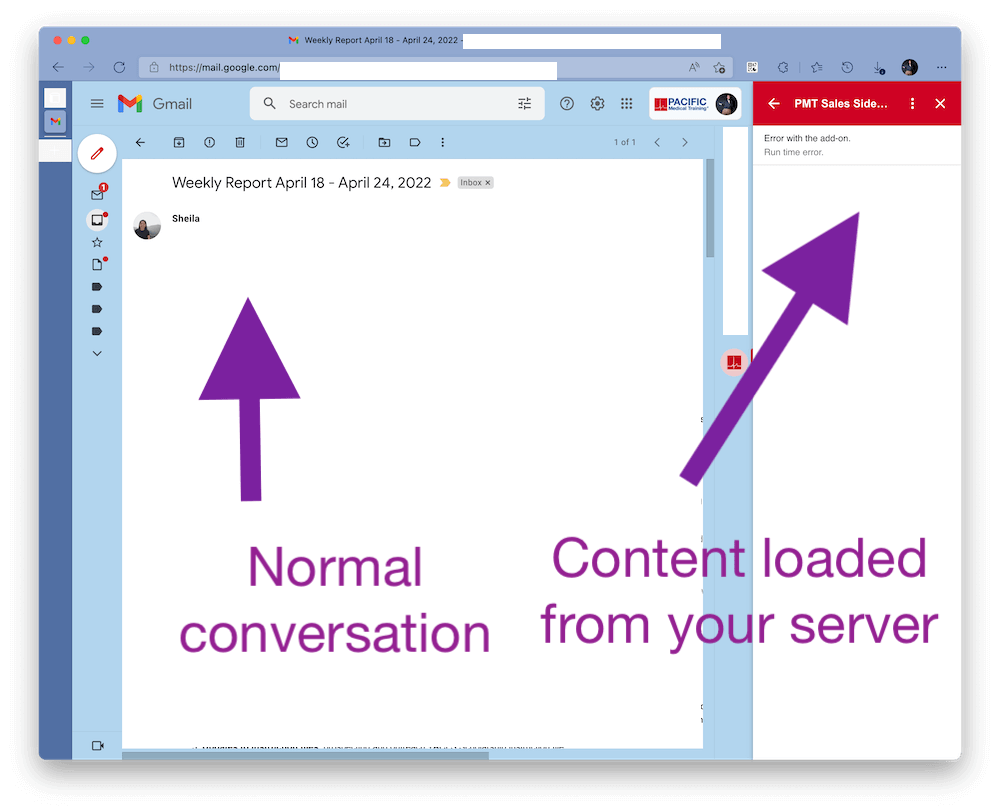

# Gmail Sidebar (client)

Adds a sidebar to your Gmail with contextual information your server provides about that contact/conversation.

This is an Apps Script that you run inside your Google account to deploy to your own Gmail account. Or you can use it to deploy across your organization. Or it can be a starting for point for a paid application you make and sell to people outside your organization.

## Prerequesites

Before you start, you must have a working Gmail account (personal or business).

To make full use of this sidebar, you will want a web server that is connected to useful contacts/business information.

## Installation

Before you start, you must have a working Gmail account (personal or business). To make full use of this 

1. Create Apps Script
   1. Visit https://script.google.com/home/start.
   2. Click NEW PROJECT on left.
   3. In the CODE EDITOR, click USE CLASSIC EDITOR
      1. :information_source: This is required because the production editor is broken and does not show "script property" settings
   4. Click PROJECT SETTINGS (gear icon on left).
   5. Check on SHOW "APPSSCRIPT.JSON" MANIFEST FILE IN EDITOR.
   6. Click EDITOR on left (code icon on left).
   7. In the Code.gs file (already selected), insert the code at [./Apps Script/Code.gs](./Apps Script/Code.gs).
   8. In the appsscript.json file, insert the code at [./Apps Script/appsscript.json](./Apps Script/appsscript.json).
      1. Add any additional URL domains under OPENLINKURLPREFIXES that you will be linking to from your add-on.
      2. :information_source: Learn about prefixes at https://developers.google.com/apps-script/add-ons/concepts/workspace-manifests
   9. Click FILE > PROJECT PROPERTIES
   10. Set SCRIPT PROPERTIES...
       1. Add a row with property `HMAC_SHA_256_KEY` and a generate a secret UUID as the value.
       2. Add a row with property `WEBHOOK_URL` and add your server's URI there.
          1. :information_source: For testing you can use this URL: https://raw.githubusercontent.com/fulldecent/gmail-sidebar-client/main/Example%20server/get-sidebar.js
2. Set up Google Cloud Platform (GCP) Project (sorry!)
   1. Drink one beer before proceeding. These instructors will probably break between when I wrote them and when you read them.
   2. Visit [Google Cloud Platform](https://developers.google.com/apps-script/guides/cloud-platform-projects).
   3. On the top, click the PROJECT button and create a new project, name it GMAIL and create.
   4. Use a magic page to find your GCP project number...
      1. Get your project name (it's in the URL).
      2. Visit https://cloud.google.com/resource-manager/reference/rest/v1/projects/get.
      3. Paste your project name in there.
      4. Authorize.
      5. In the response, extract the PROJECT NUMBER.
3. Create test deployment into Gmail
   1. Click PUBLISH > DEPLOY FROM MANIFEST.
   2. Click to OPEN IN GMAIL.
4. Authorize in Gmail
   1. Open Gmail.
   2. Click SHOW SIDE PANEL (button on bottom-right).
   3. Click your application (red icon, if you did not change it).
   4. Click AUTHORIZE ACCESS (when I tried this, the page froze and I needed to reload and try again).
